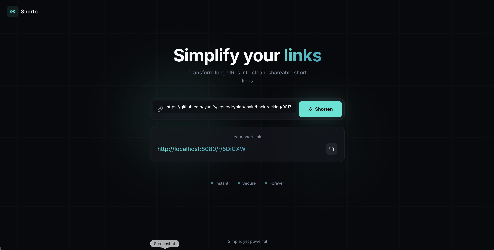
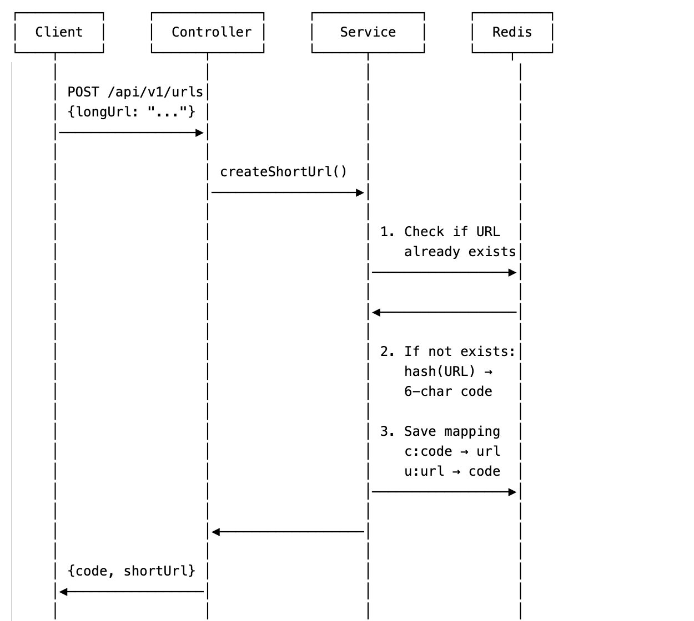
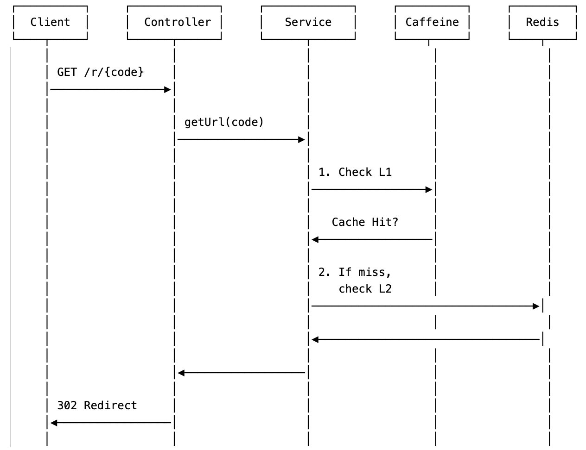

# Shorto

A High-Performance Distributed **URL Shortening Service**



## Run on macOS

Shorto runs locally with Java 17, Spring Boot, and a standalone Redis instance.

See [the macOS setup guide](MACOS_SETUP.md) for prerequisites, installation, startup, and troubleshooting.

After startup, open **http://localhost:8080** to use Shorto.

The separate [Shorto presentation](shorto-presentation/README.md) explains the architecture and design. It runs at **http://localhost:3000** and is maintained independently of the application's user interface.

## System Architecture

```
┌──────────────┐     ┌──────────────────┐     ┌─────────────────┐     ┌─────────────────┐
│    Client    │ ──▶ │  Spring Boot App │ ──▶ │  Caching Layer  │ ──▶ │  Redis Storage  │
│ Browser/Mobile│     │   REST | Service │     │ L1: Caffeine    │     │   AOF Enabled   │
└──────────────┘     └──────────────────┘     │ L2: Redis       │     └─────────────────┘
                                              └─────────────────┘
```

- **Caffeine (L1)**: In-memory cache for hot data (sub-ms latency)
- **Redis (L2)**: Persistent storage for all URLs with AOF durability


## Core Logic & Flows

### URL Shortening Flow



*Sequence diagram illustrating the interaction between Client, Controller, Service, and Redis.*

### Redirect Flow




---


### Collision Handling Flow

```
        ┌─────────────────────────┐
        │  Generate Short Code    │
        └───────────┬─────────────┘
                    │
          ┌─────────┴─────────┐
          ▼                   ▼
   ┌─────────────┐     ┌─────────────┐
   │  ✓ Success  │     │  ✗ Collision│
   │ Return Code │     │             │
   └─────────────┘     └──────┬──────┘
                              │
                              ▼
                    ┌─────────────────┐
                    │ Retry with Salt │
                    │ hash(url + "#1")│
                    └────────┬────────┘
                             │
                             └──── (loop back)
```

---

## Data Storage & Persistence

Optimized for high-speed read/write operations using Redis key-value store with durability guarantees.

### Data Mappings

| Type | Key Pattern | Value | Purpose |
|------|-------------|-------|---------|
| **Forward Mapping** | `c:{code}` | `{url}` | Code → URL lookup |
| **Reverse Index** | `u:{url}` | `{code}` | Deduplication |

### Storage Configuration

| Setting | Value |
|---------|-------|
| **Database** | Redis Key-Value |
| **TTL Policy** | 30 Days (Default) |
| **Persistence** | AOF Enabled |


## Performance

- **200 QPS** for URL retrieval
- **100 QPS** for URL creation
- **P99 < 40ms** latency

## Author

Yun Li ([yunify.cs@gmail.com](mailto:yunify.cs@gmail.com))

## License

This project is licensed under the [MIT License](LICENSE).
